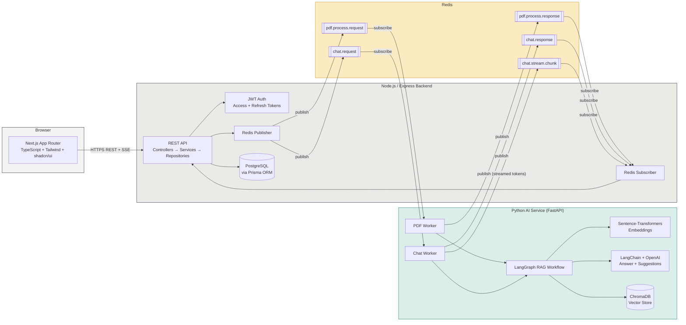

# System Architecture

**Key design decision:** the Node backend and Python AI service never call each other over
HTTP. All AI processing (PDF ingestion, retrieval, answer generation, suggested questions) is
requested and returned exclusively through Redis Pub/Sub topics, decoupling the two runtimes
and letting either scale or restart independently.
