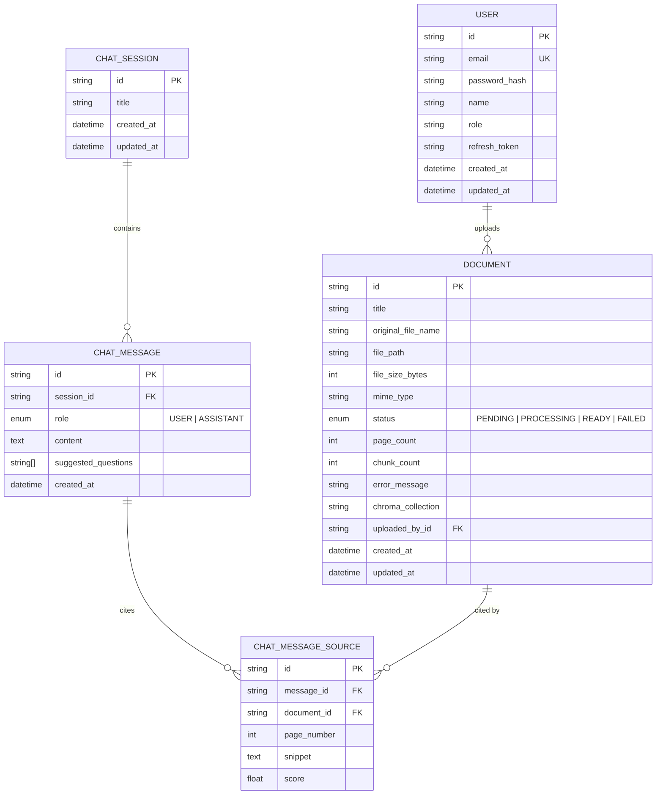

# Entity-Relationship Diagram

Indexes: `users(email)`, `users(created_at)`, `documents(status)`, `documents(created_at)`,
`documents(updated_at)`, `documents(uploaded_by_id)`, `chat_sessions(created_at)`,
`chat_sessions(updated_at)`, `chat_messages(session_id)`, `chat_messages(created_at)`,
`chat_message_sources(message_id)`, `chat_message_sources(document_id)`.

See `backend/prisma/schema.prisma` for the source of truth and
`backend/prisma/migrations/20250101000000_init/migration.sql` for the generated SQL.
