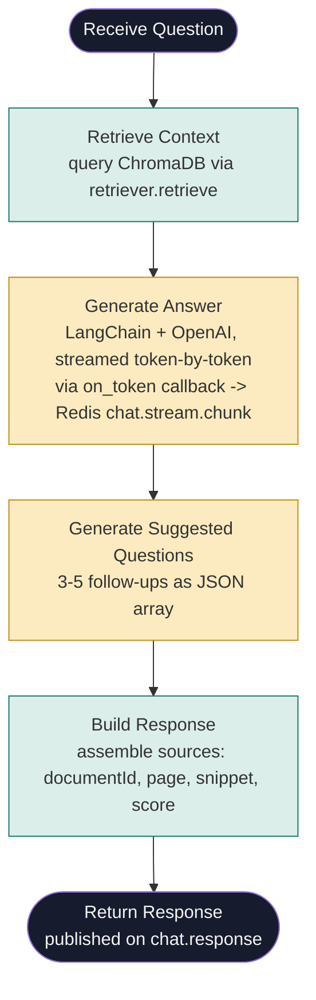

# LangGraph RAG Workflow

Implemented in `python-ai/app/graph/workflow.py` using `langgraph.graph.StateGraph`, with node
functions in `python-ai/app/graph/nodes.py` and shared state typed in
`python-ai/app/graph/state.py`. Conversation memory (recent turns, owned by the Node backend in
PostgreSQL) is passed into the graph as `history_text` on each invocation so the same graph is
stateless and safely handles concurrent requests from different sessions.
