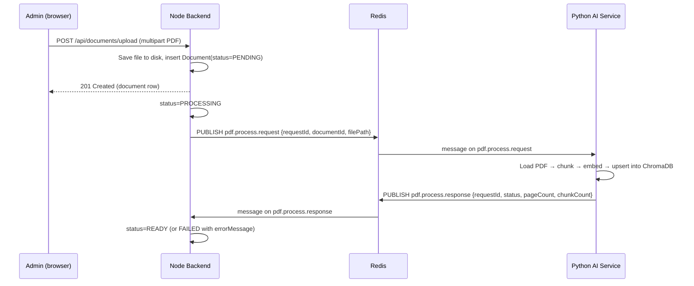
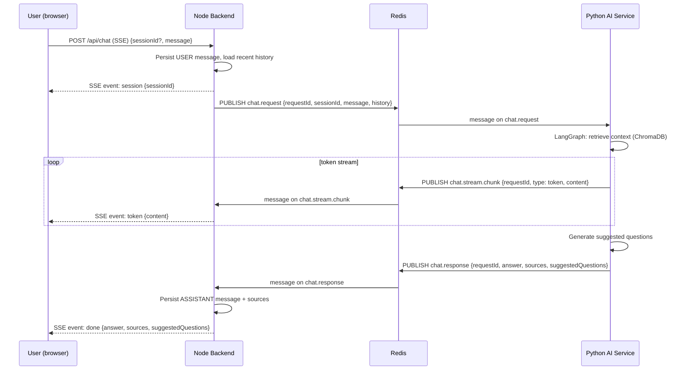

# Redis Pub/Sub Flow

## PDF Upload & Processing

```mermaid
sequenceDiagram
    participant U as Admin (browser)
    participant B as Node Backend
    participant R as Redis
    participant P as Python AI Service

    U->>B: POST /api/documents/upload (multipart PDF)
    B->>B: Save file to disk, insert Document(status=PENDING)
    B-->>U: 201 Created (document row)
    B->>B: status=PROCESSING
    B->>R: PUBLISH pdf.process.request {requestId, documentId, filePath}
    R->>P: message on pdf.process.request
    P->>P: Load PDF → chunk → embed → upsert into ChromaDB
    P->>R: PUBLISH pdf.process.response {requestId, status, pageCount, chunkCount}
    R->>B: message on pdf.process.response
    B->>B: status=READY (or FAILED with errorMessage)
```

## Chat (Streaming)

```mermaid
sequenceDiagram
    participant U as User (browser)
    participant B as Node Backend
    participant R as Redis
    participant P as Python AI Service

    U->>B: POST /api/chat (SSE) {sessionId?, message}
    B->>B: Persist USER message, load recent history
    B-->>U: SSE event: session {sessionId}
    B->>R: PUBLISH chat.request {requestId, sessionId, message, history}
    R->>P: message on chat.request
    P->>P: LangGraph: retrieve context (ChromaDB)
    loop token stream
        P->>R: PUBLISH chat.stream.chunk {requestId, type: token, content}
        R->>B: message on chat.stream.chunk
        B-->>U: SSE event: token {content}
    end
    P->>P: Generate suggested questions
    P->>R: PUBLISH chat.response {requestId, answer, sources, suggestedQuestions}
    R->>B: message on chat.response
    B->>B: Persist ASSISTANT message + sources
    B-->>U: SSE event: done {answer, sources, suggestedQuestions}
```
